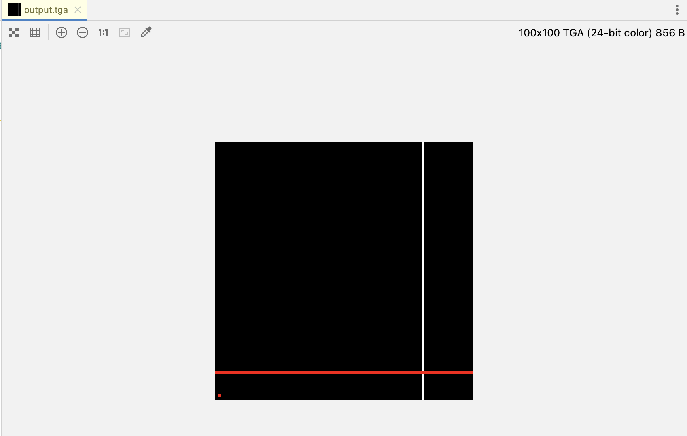

# TinyRenderer-CN
TinyRenderer是一个从零开始用C++写一个光栅化渲染器，不依赖任何外部库，实现一个超级简化版的OpenGL，本项目作为该项目的翻译。

| 作者 | ssloy       |
| --- |-------------|
| 翻译 | zouchanglin |
| 校对 | 无           |

## lesson0-前言
500行代码向你展示OpenGL中的渲染基本工作原理！

本项目是一个微型光栅器，如果您正在寻找关于一个微型光线追踪器的Demo，可以看看原作者的另一个开源项目 [tinyraytracer](https://github.com/ssloy/tinyraytracer)。

其实这份代码具体怎么写的并不重要。阅此读 wiki 并实现您自己的渲染器。只有当你真正体会过这些实现细节时，你才会知道发生到底了什么，自己做一遍是非常重要的。

如果有任何问题，可以通过电子邮件获取反馈，[dmitry.sokolov@univ-lorraine.fr](mailto:dmitry.sokolov@univ-lorraine.fr)。

> 另外如果翻译相关问题，可以直接提issues，或者发邮件[zchanglin@163.com](mailto:zchanglin@163.com)。

如果您是一名教师并想为您的班级使用/改编此项目 - 非常欢迎您这样做，无需授权。只需通过邮件通知我，它将帮助我改进这个教程。

在本系列文章中，我想通过一个非常简化的工作流来展示 OpenGL 的工作方式。令人惊讶的是，我经常遇到在最初学习 OpenGL/DirectX 无法克服障碍的人。因此，我准备了一系列简短的讲座，之后我的学生做出了相当不错的渲染器。

所以，任务制定如下：不使用第三方库（尤其是图形库），得到如下图：

> 注意：这只是一个简单复刻 OpenGL 库的练习项目，一个软件渲染器。它目的并不是展示如何编写 OpenGL 程序，而是展示 OpenGL 是如何运作的。如果不清楚 OpenGL 运作原理，是不可能用 3D 库编写出高效的程序的。

我将尽力把最终代码限制在 500 行左右。我的学生需要 10 到 20 小时的编程做出这样的渲染器。我们把一个带有多边形线的测试文件，以及一张图片形式的纹理作为输入，最终输出一个渲染的模型。程序没有图形化界面，只是简单生成一张图片。

我们的目的是减少外部依赖，所以我给学生的只有一个能导入 TGA 文件的类。TGA 是一种支持 RGB/RGBA/灰度图的最简单的格式之一。你应该注意，最开始我们只有一个简单处理图片的功能 (除加载和保存图片)，即设置一个像素的颜色。

没有绘制线段和三角形的函数，以后都会手写出来。我会提供源代码，这是跟学生们一起写的。当然，我不建议你直接使用，因为这没有意义。整个项目的源代码都可以在 github 访问，并且在 [这里](https://github.com/ssloy/tinyrenderer/tree/909fe20934ba5334144d2c748805690a1fa4c89f) 你会找到我给学生们的代码。

```cpp
#include "lib/tgaimage.h"

const TGAColor white = TGAColor(255, 255, 255, 255);
const TGAColor red   = TGAColor(255, 0,   0,   255);

int main(int argc, char* argv[]){
    TGAImage image(100, 100, TGAImage::RGB);
    for (int i = 0; i < 100; ++i) {
        image.set(80, i, white);
    }

    for (int i = 0; i < 100; ++i) {
        image.set(i, 10, red);
    }

    image.set(1,1,red);

    // 垂直翻转，因为我们习惯性以左下角作为坐标原点
    image.flip_vertically();

    image.write_tga_file("output.tga");
    return 0;
}
```
这段代码生成的TGA文件如下：

