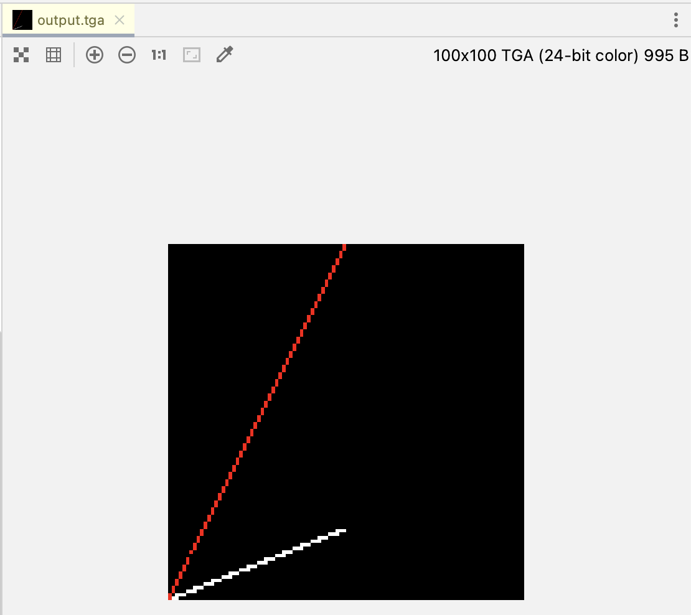
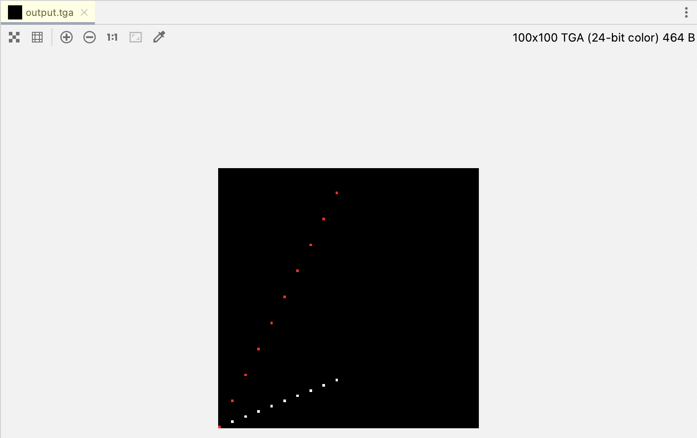
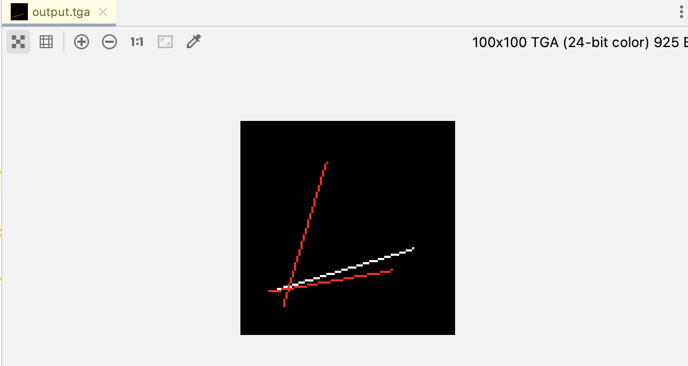
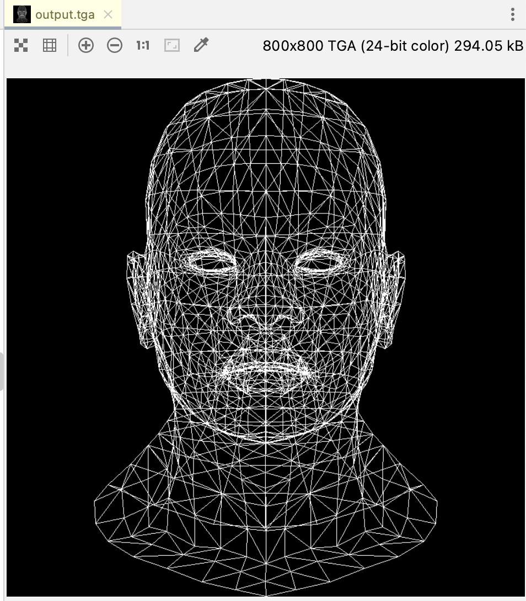

# TinyRenderer-CN

| 作者 | ssloy       |
| --- |-------------|
| 翻译 | zouchanglin |
| 校对 | 无           |

## lesson2-Bresenham 线段绘制算法
### 首次尝试
第一节课的目标是渲染Mesh网格。为此，应该先学习如何绘制线段，需要简单阅读 Bresenham 的线段绘制算法，然后自己编码。绘制一条从 (x0, y0) 到 (x1, y1) 的最简单的代码应该是什么样？显然像这样：
```cpp
#include "lib/tgaimage.h"

const TGAColor white = TGAColor(255, 255, 255, 255);
const TGAColor red = TGAColor(255, 0,   0,   255);


void line(int x0, int y0, int x1, int y1, TGAImage &image, TGAColor color) {
    for (float t = 0.; t < 1.; t += .01) {
        int x = x0 + (x1 - x0) * t;
        int y = y0 + (y1 - y0) * t;
        image.set(x, y, color);
    }
}

int main(int argc, char* argv[]){
    TGAImage image(100, 100, TGAImage::RGB);

    line(0, 0, 50, 20, image, white);
    line(0, 0, 50, 100, image, red);

    // 垂直翻转，因为我们习惯性以左下角作为坐标原点
    image.flip_vertically();

    image.write_tga_file("output.tga");
    return 0;
}
```


### 第二次尝试
当前代码存在的问题(处理效率低下)是对于常量的选择，我们选的是 0.01。如果用 0.1，绘制出的线段像这样：

显而易见的是：这个 t 常量恰巧能决定要绘制的像素数。简单但有错的代码看起来像这样：
```cpp
void line(int x0, int y0, int x1, int y1, TGAImage &image, TGAColor color) {
    for (int x = x0; x <= x1; x++) {
        float t = (x - x0) / (float)(x1 - x0);
        int y = y0 * (1. - t) + y1 * t;
        image.set(x, y, color);
    }
}
```
>译者注：其实这种方式很容易理解，x 从 x0 变到 x1 ，只要让 y 也同等均匀的从 y0 变化到 y1 即可

但是下面三个用例中只能勉强通过两个 （运行会发现第二条线由很多小孔组成，第三条线直接看不见）
```cpp
line(13, 20, 80, 40, image, white); 
line(20, 13, 40, 80, image, red); 
line(80, 40, 13, 20, image, red);
```
注意，第一行和第三行代码绘制的是不同颜色、相反方向的同一条线(翻转了起点终点)。我们已经看到，白色那条绘制得很好。在我设想中，白色那条线应该是红色的，但实际上不是。这是一个对称性的测试：线段的绘制结果，不应受线段起点终点的影响，即线段 (a, b) 应该和 (b, a) 是完全相同的。

### 第三次尝试
通过交换起点终点，使 x0 小于 x1，我们修复了缺失的那条红线。

之前绘制的线中，其中一条上有很多小间隔，这是因为两点之间横向的距离远远大于纵向的距离。我的学生们经常建议这样改进：
```cpp
void line(int x0, int y0, int x1, int y1, TGAImage &image, TGAColor color) {
    bool steep = false;
    if (abs(x0 - x1) < abs(y0 - y1)) { // 如果线段很陡，我们转置图像
        std::swap(x0, y0);
        std::swap(x1, y1);
        steep = true;
    }
    if (x0 > x1) { // 确保线段是从左往右绘制
        std::swap(x0, x1);
        std::swap(y0, y1);
    }
    for (int x = x0; x <= x1; x++) {
        float t = (x - x0) / (float)(x1 - x0);
        int y = y0 * (1. - t) + y1 * t;
        if (steep) {
            image.set(y, x, color); // 如果图像已经转置，则先还原再绘制
        } else {
            image.set(x, y, color);
        }
    }
}
```


### 第四次尝试的准备工作
> 注意: 出于历史原因，编译器的优化器(g++ -O3)通常比我们做得更好。

上面的代码工作一切正常，适用于各种直线的复杂情况，这正是我们想要在最终版本里看到的效果。它肯定是低效，但它简短易读。请注意，它没有断言，也没有超出边界的检查，应该进行系统性的检查与优化。

优化是一件危险的事情。我们应该清楚代码将在哪个平台上运行。为显卡或 CPU 优化代码是完全不同的事情。在任何优化之前和期间，必须对代码进行分析。尝试猜测，这里哪个操作是最耗费资源的操作？

绘制之前绘制的 3 条线段重复进行1,000,000次。我的 CPU 是 Intel® Core(TM) i5-3450 CPU @ 3.10GHz。对于每个像素，此代码调用 TGAColor 复制构造函数。即 1000000 * 3 条线段 * 每条线段大约 50 个像素。非常多次的调用，从哪里开始优化？性能分析器会告诉我们：
我用 `g++ -ggdb -g -pg -O0` 指令编译代码，然后运行得出如下数据：
```
%   cumulative   self              self     total 
 time   seconds   seconds    calls  ms/call  ms/call  name 
 69.16      2.95     2.95  3000000     0.00     0.00  line(int, int, int, int, TGAImage&, TGAColor) 
 19.46      3.78     0.83 204000000     0.00     0.00  TGAImage::set(int, int, TGAColor) 
  8.91      4.16     0.38 207000000     0.00     0.00  TGAColor::TGAColor(TGAColor const&) 
  1.64      4.23     0.07        2    35.04    35.04  TGAColor::TGAColor(unsigned char, unsigned char, unsigned char, unsigned char) 
  0.94      4.27     0.04                             TGAImage::get(int, int)
```
10% 的时间用于拷贝颜色，但超过 70% 的时间被用于调用 line！这就是我们要优化的地方。
> 其实，也能看出来，耗时主要在浮点运算上，而且还有很多重复运算，都可以用保存临时变量的方式减少运算量

### 第四次尝试
我们能注意到，每次循环中除法的除数 (x1 - x0) 都是相同的，把这步计算拿到循环外。error 变量表示我们当前绘制像素 (x, y) 到理想直线的距离 (沿轴线的距离，而不是垂直距离)。每当 error 大于一个像素的长度，我们将 y 增加 1，同时将 error 减小 1。
```cpp
void line(int x0, int y0, int x1, int y1, TGAImage &image, TGAColor color) {
    bool steep = false;
    if (abs(x0 - x1) < abs(y0 - y1)) { // 如果线段很陡，我们转置图像
        std::swap(x0, y0);
        std::swap(x1, y1);
        steep = true;
    }
    if (x0 > x1) { // 确保线段是从左往右绘制
        std::swap(x0, x1);
        std::swap(y0, y1);
    }

    float slope = abs((float)(y1 - y0)/(float)(x1 - x0));
    float step = 0;
    int y = y0;

    for (int x = x0; x <= x1; x++) {
        if (steep) {
            image.set(y, x, color); // 如果图像已经转置，则先还原再绘制
        } else {
            image.set(x, y, color);
        }
        step += slope;
        if(step > 0.5){
            y += (y1 > y0 ? 1:-1); // 直线的方向影响
            step -= 1;
        }
    }
}
```
这里是性能分析输出的内容：
```
%   cumulative   self              self     total 
 time   seconds   seconds    calls  ms/call  ms/call  name 
 38.79      0.93     0.93  3000000     0.00     0.00  line(int, int, int, int, TGAImage&, TGAColor) 
 37.54      1.83     0.90 204000000     0.00     0.00  TGAImage::set(int, int, TGAColor) 
 19.60      2.30     0.47 204000000     0.00     0.00  TGAColor::TGAColor(int, int) 
  2.09      2.35     0.05        2    25.03    25.03  TGAColor::TGAColor(unsigned char, unsigned char, unsigned char, unsigned char) 
  1.25      2.38     0.03                             TGAImage::get(int, int) 
```

### 第五次尝试
仍然是优化浮点数计算？我们用到浮点数的地方，只有一次求 slope 的除法、一次在循环体中的与 0.5 的比较。我们可以用整型变量代替浮点数，代码如下：
```cpp
void line(int x0, int y0, int x1, int y1, TGAImage &image, TGAColor color) {
    bool steep = false;
    if (abs(x0 - x1) < abs(y0 - y1)) { // 如果线段很陡，我们转置图像
        std::swap(x0, y0);
        std::swap(x1, y1);
        steep = true;
    }
    if (x0 > x1) { // 确保线段是从左往右绘制
        std::swap(x0, x1);
        std::swap(y0, y1);
    }

    int dx = abs(x1 - x0);
    int dy = abs(y1 - y0);
    int slope = 2 * dy;
    int step = 0;

    int y = y0;

    for (int x = x0; x <= x1; x++) {
        if (steep) {
            image.set(y, x, color); // 如果图像已经转置，则先还原再绘制
        } else {
            image.set(x, y, color);
        }
        step += slope;
        if(step > dx){
            y += (y1 > y0 ? 1:-1); // 直线的方向影响
            step -= dx * 2;
        }
    }
}
```
下面是性能分析结果：
```
%   cumulative   self              self     total 
 time   seconds   seconds    calls  ms/call  ms/call  name 
 42.77      0.91     0.91 204000000     0.00     0.00  TGAImage::set(int, int, TGAColor) 
 30.08      1.55     0.64  3000000     0.00     0.00  line(int, int, int, int, TGAImage&, TGAColor) 
 21.62      2.01     0.46 204000000     0.00     0.00  TGAColor::TGAColor(int, int) 
  1.88      2.05     0.04        2    20.02    20.02  TGAColor::TGAColor(unsigned char, unsigned char, unsigned char, unsigned char) 
```
相比之前的耗时从 2.95s 减少到 0.64s。

> 当然，像优化的方式还有消除循环中的分支指令，把 `(y1 > y0 ? 1 : -1);` 这样的计算提取出变量等。

```cpp
void line(int x0, int y0, int x1, int y1, TGAImage &image, TGAColor color) {
    bool steep = false;
    if (abs(x0 - x1) < abs(y0 - y1)) { // 如果线段很陡，我们转置图像
        std::swap(x0, y0);
        std::swap(x1, y1);
        steep = true;
    }
    if (x0 > x1) { // 确保线段是从左往右绘制
        std::swap(x0, x1);
        std::swap(y0, y1);
    }

    int dx = abs(x1 - x0);
    int dy = abs(y1 - y0);
    int slope = 2 * dy;
    int step = 0;

    int y = y0;
    
    // https://github.com/ssloy/tinyrenderer/issues/28
    const int yinCr = (y1 > y0 ? 1 : -1);
    if(steep) {
        for(int x = x0; x <= x1; ++x) {
            image.set(y, x, color);
            step += slope;
            if(step > dx) {
                y += yinCr;
                step -= dx * 2;
            }
        }
    } else {
        for(int x = x0; x<=x1; ++x) {
            image.set(x, y, color);
            step += slope;
            if(step > dx) {
                y += yinCr;
                step -= dx * 2;
            }
        }
    }
}
```
### 渲染网格
我们已经学会了如何渲染一条线，现在准备去渲染一个模型的网格，你可以在这里找到对应的 [代码快照与素材模型](https://github.com/ssloy/tinyrenderer/tree/f6fecb7ad493264ecd15e230411bfb1cca539a12) 我用的是 wavefront obj 文件格式存储模型。渲染需要的数据是从文件中读取的顶点数组，格式如下：
```
v 0.608654 -0.568839 -0.416318
```
文件中的每一行标识模型的顶点的 x、y、z 坐标
```
f 1193/1240/1193 1180/1227/1180 1179/1226/1179
```
我们感兴趣的是每个空格后第一个数字，这是我们之前读取的顶点数组中顶点的编号。因此，这行表示 1193、1180、1179 号顶点构成一个三角形。注意，obj 文件的索引是从 1 开始的，也就是说你应该分别从下标 1192、1179、1178 中找到这三个顶点。model.cpp 文件包含一个简单的解析器，把下边的循环写到我们的 main.cpp，瞧，线渲染完成了！


下次我们将绘制二维三角形和改进我们的渲染器。