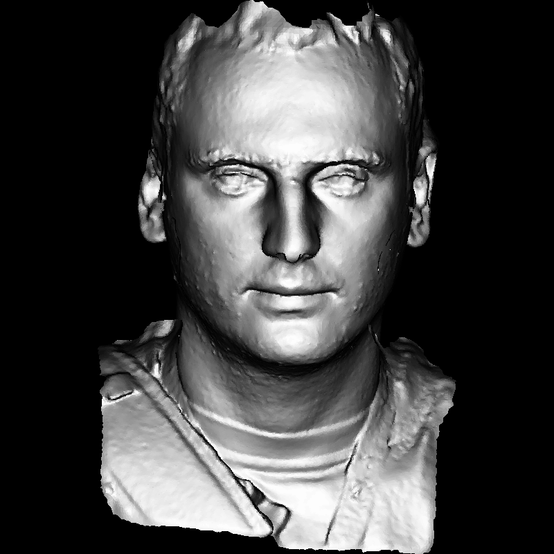
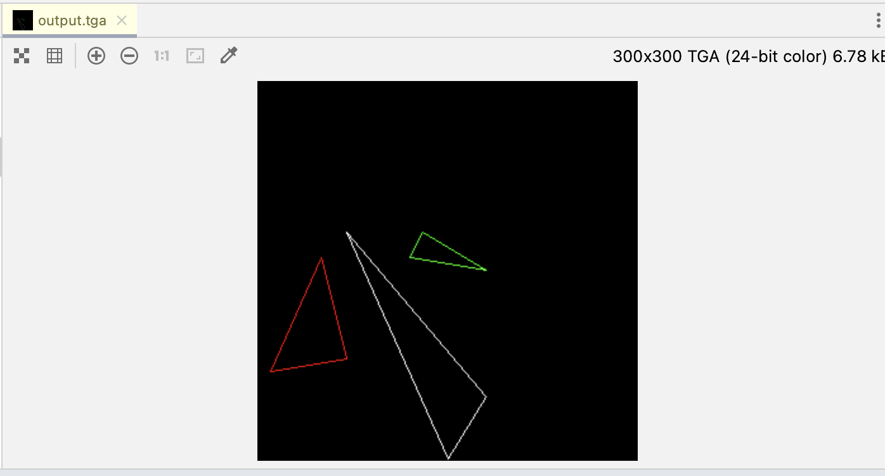
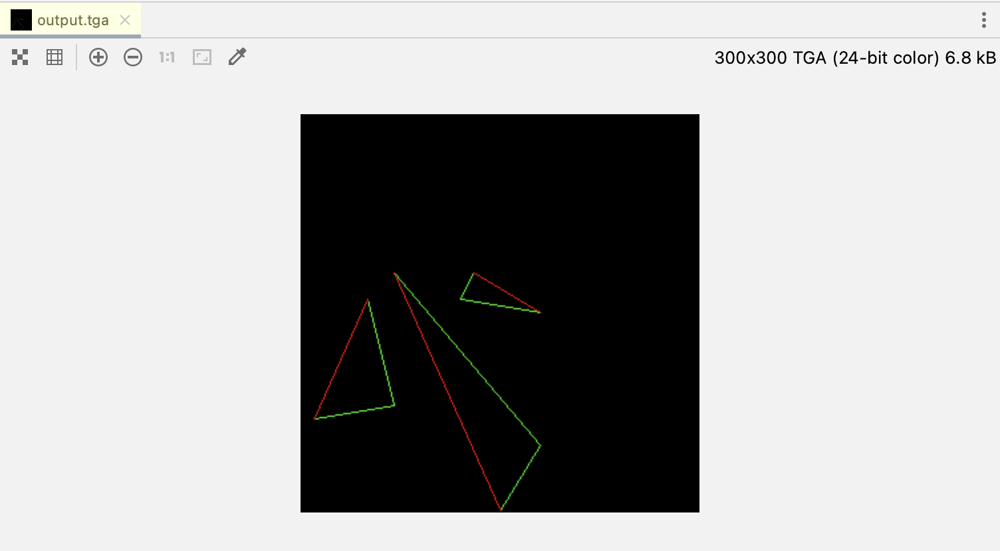
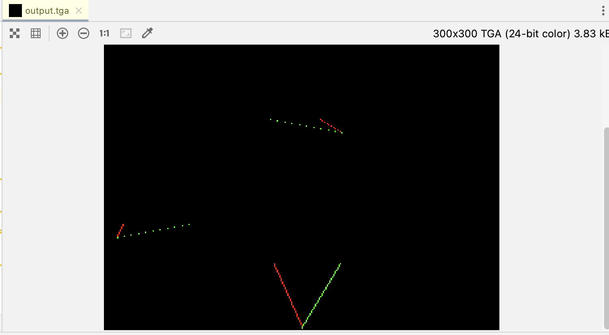
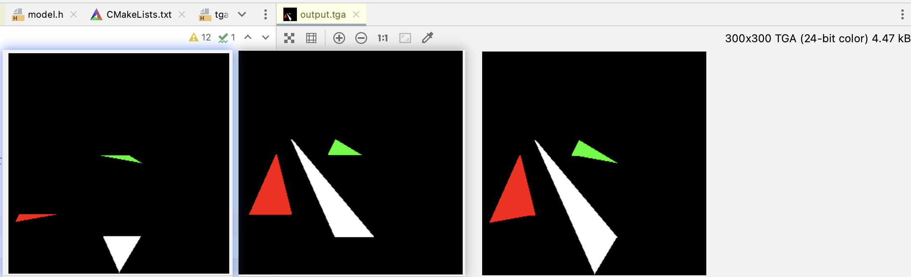
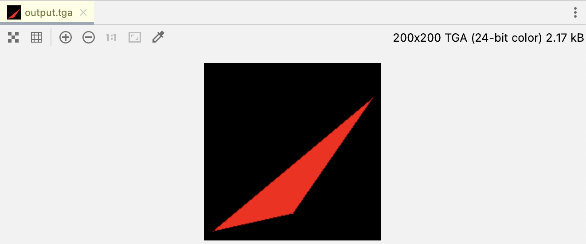

# lesson2-三角形的光栅化与背面剔除

| 作者 | ssloy       |
| --- |-------------|
| 翻译 | zouchanglin |
| 校对 | 无           |

## 填充三角形
大家好，下面是我的面部模型


更准确地说，在接下来的一到两个小时里我们的渲染器要渲染的就是我的脸部模型。上次我们画了一个三维模型的网格。这一次，我们将填充多边形，或者说三角形。实际上，OpenGL 几乎对于任意多边形都会分割为三角形，因此无需考虑复杂的情况。

再次提醒一下，本系列文章的目的是让您自己动手实现一个渲染器。你可以在两个小时内实现用代码渲染一个像上面这样的图片，但是并不是让通过两个小时的时间来阅读我的代码，现在你应该从零开始自己动手实现这样一份代码了，之所以提供我的代码是为了方便你做对比。我的代码不见得比你的代码更高明或者更优秀，所以不要单纯简单地复制粘贴我的代码。欢迎提出任何意见和问题。

### 传统方式 —— 扫线

任务是绘制二维三角形。 对于积极的学生来说，即使他们不是一个优秀的程序员，通常几个小时内也能搞定。 上次我们学习了 Bresenham 的直线绘制算法，今天的任务是画一个实心三角形。 很有趣但用处不大。我的大多数学生都在为这个简单的任务而苦苦挣扎。 最初的代码如下所示：

```c++
#include "lib/tgaimage.h"
#include <cmath>
#include <iostream>
#include "lib/model.h"
#include <vector>

const TGAColor white = TGAColor(255, 255, 255, 255);
const TGAColor red = TGAColor(255, 0,   0,   255);
const TGAColor green = TGAColor(0, 255,   0,   255);

const int width  = 300;
const int height = 300;

void line(Vec2i t0, Vec2i t1, TGAImage &image, TGAColor color) {
    int x0 = t0.x;
    int y0 = t0.y;
    int x1 = t1.x;
    int y1 = t1.y;
    bool steep = false;
    if (abs(x0 - x1) < abs(y0 - y1)) { // 如果线段很陡，我们转置图像
        std::swap(x0, y0);
        std::swap(x1, y1);
        steep = true;
    }
    if (x0 > x1) { // 确保线段是从左往右绘制
        std::swap(x0, x1);
        std::swap(y0, y1);
    }

    int dx = abs(x1 - x0);
    int dy = abs(y1 - y0);
    int slope = 2 * dy;
    int step = 0;

    int y = y0;

    const int yinCr = (y1 > y0 ? 1 : -1);
    if(steep) {
        for(int x = x0; x<=x1; ++x) {
            image.set(y, x, color);
            step += slope;
            if(step > dx) {
                y += yinCr;
                step -= dx * 2;
            }
        }
    } else {
        for(int x = x0; x<=x1; ++x) {
            image.set(x, y, color);
            step += slope;
            if(step > dx) {
                y += yinCr;
                step -= dx * 2;
            }
        }
    }
}

void triangle(Vec2i t0, Vec2i t1, Vec2i t2, TGAImage &image, TGAColor color) {
    line(t0, t1, image, color);
    line(t1, t2, image, color);
    line(t2, t0, image, color);
}

int main(int argc, char* argv[]){
    TGAImage image(width, height, TGAImage::RGB);
    Vec2i t0[3] = {Vec2i(10, 70),   Vec2i(50, 160),  Vec2i(70, 80)};
    Vec2i t1[3] = {Vec2i(180, 50),  Vec2i(150, 1),   Vec2i(70, 180)};
    Vec2i t2[3] = {Vec2i(180, 150), Vec2i(120, 160), Vec2i(130, 180)};
    triangle(t0[0], t0[1], t0[2], image, red);
    triangle(t1[0], t1[1], t1[2], image, white);
    triangle(t2[0], t2[1], t2[2], image, green);
  
    image.flip_vertically();
    image.write_tga_file("output.tga");

    return 0;
}
```



与往常一样，类似的 commit [在这](https://github.com/ssloy/tinyrenderer/tree/7e46cc57fa3f5a41129d6b6fefe4e77f77b8aa84)。代码很简单：我在初始代码中提供了三个三角形供调试。如果在 triangle 函数中包含 `line()`，我们会得到一个三角形的轮廓，那接下来如何填充三角形呢？

 一个绘制三角形的算法应该包括以下功能：

- 简单高效，非常快速的就可以绘制完成。
- 应该具有对称性：图片的绘制结果，不应受传递给绘制函数的顶点的顺序影响。
- 如果两个三角形有两个共同的顶点，则它们之间应该没有孔，因为光栅化——。
- 我们可能会提出更多的需求，但可以先做一个出来简单版本。使用传统的扫线方式：
    1. 按顶点的 y 坐标排序
    2. 从三角形左右两侧同时光栅化
    3. 在三角形左右两侧的端点之间，绘制一条水平线段

这时候，我的学生们发现自己忘了一些基础的东西：哪条边在左侧，哪条在右侧？另外，一个三角形有三条边 …… 通常，我让学生们自己捣鼓大约一个小时。再次声明：直接阅读我的代码没有意义，不如你自己写完再来比较。

如何绘制一个三角形？再次提示：如果你有更好的方法，我非常乐于接受并与你探讨。假设某个三角形的三个顶点：t0、t1、t2，按 y 坐标排序，A、B 边分别由 t0 t2、t0 t1构成，并且位于t1 t2之间。

```cpp
void triangle(Vec2i t0, Vec2i t1, Vec2i t2, TGAImage &image, TGAColor color) { 
    // sort the vertices, t0, t1, t2 lower−to−upper (bubblesort yay!) 
    if (t0.y>t1.y) std::swap(t0, t1); 
    if (t0.y>t2.y) std::swap(t0, t2); 
    if (t1.y>t2.y) std::swap(t1, t2); 
    line(t0, t1, image, green); 
    line(t1, t2, image, green); 
    line(t2, t0, image, red); 
}
```

可以看到这里边界 A 是红色的，边界 B 是绿色的：



> 译者注：为什么需要分成左右两部分呢？其实很好理解，接下里作者想把三角形通过水平切割线分成上下两部分，这样的话就可以通过水平扫线的方式的填充这个三角形。

不足的是，B 边由两部分组成，我们在水平方向上切割，仅绘制三角形的下半部分：

```c++
void triangle(Vec2i t0, Vec2i t1, Vec2i t2, TGAImage &image, TGAColor color) {
    // sort the vertices, t0, t1, t2 lower−to−upper (bubblesort yay!)
    if (t0.y > t1.y) std::swap(t0, t1);
    if (t0.y > t2.y) std::swap(t0, t2);
    if (t1.y > t2.y) std::swap(t1, t2);
    int total_height = t2.y - t0.y;
    for (int y = t0.y; y <= t1.y; y++) {
        int segment_height = t1.y - t0.y + 1;
        float alpha = (float)(y - t0.y) / total_height;
        float beta  = (float)(y - t0.y) / segment_height; // be careful with divisions by zero
        Vec2i A = t0 + (t2 - t0) * alpha;
        Vec2i B = t0 + (t1 - t0) * beta;
        image.set(A.x, y, red);
        image.set(B.x, y, green);
    }
}
```



注意这些线段是不连续的，之前我们绘制直线的时候，想尽办法让他们连续，但在这里，我没注意是否要转置图像(记得 x、y 的交换吗)。为什么？因为我们在这后边会填充三角形，到时候不连续线段上的间隙就看不到了。

所以我们可以先绘制下半部分，在绘制上半部分，如果如下所示：

```cpp
void triangle(Vec2i t0, Vec2i t1, Vec2i t2, TGAImage &image, TGAColor color) {
    // sort the vertices, t0, t1, t2 lower−to−upper (bubblesort yay!)
    if (t0.y > t1.y) std::swap(t0, t1);
    if (t0.y > t2.y) std::swap(t0, t2);
    if (t1.y > t2.y) std::swap(t1, t2);
    int total_height = t2.y - t0.y;
    for (int y = t0.y; y <= t1.y; y++) {
        int segment_height = t1.y - t0.y + 1;
        float alpha = (float)(y - t0.y) / total_height;
        float beta  = (float)(y - t0.y) / segment_height; // be careful with divisions by zero
        Vec2i A = t0 + (t2 - t0) * alpha;
        Vec2i B = t0 + (t1 - t0) * beta;

        // 绘制水平扫线
        if (A.x > B.x) std::swap(A, B);
        for (int j = A.x; j <= B.x; j++) {
            image.set(j, y, color); // attention, due to int casts t0.y+i != A.y
        }
    }

    for (int y = t1.y; y <= t2.y; y++) {
        int segment_height =  t2.y - t1.y + 1;
        float alpha = (float)(y - t0.y) / total_height;
        float beta  = (float)(y - t1.y) / segment_height;
        Vec2i A = t0 + (t2 - t0) * alpha;
        Vec2i B = t1 + (t2 - t1) * beta;
        if (A.x > B.x) std::swap(A, B);
        // 绘制水平扫线
        for (int j = A.x; j <= B.x; j++) {
            image.set(j, y, color);
        }
    }
}
```



这可能就足够了，但我不喜欢看到重复代码。这就是为什么我们将使它的可读性降低，但更便于修改/维护：

```cpp
void triangle(Vec2i t0, Vec2i t1, Vec2i t2, TGAImage &image, TGAColor color) {
    if (t0.y == t1.y && t0.y == t2.y) return; // 不用关心非三角形
    if (t0.y > t1.y) std::swap(t0, t1);
    if (t0.y > t2.y) std::swap(t0, t2);
    if (t1.y > t2.y) std::swap(t1, t2);
    int total_height = t2.y - t0.y;
    for (int i = 0; i < total_height; i++) {
        bool second_half = i > t1.y - t0.y || t1.y == t0.y;
        int segment_height = second_half ? t2.y - t1.y : t1.y - t0.y;
        float alpha = (float)i / total_height;
        float beta = (float)(i - (second_half ? t1.y - t0.y : 0)) / segment_height;
        Vec2i A = t0 + (t2 - t0) * alpha;
        Vec2i B = second_half ? t1 + (t2 - t1) * beta : t0 + (t1 - t0) * beta;
        if (A.x > B.x) std::swap(A, B);
        for (int j = A.x; j <= B.x; j++) {
            image.set(j, t0.y + i, color);
        }
    }
}
```

### 我要采用的方式

虽然不是很复杂，但扫线的源码有点混乱。另外，扫线的方式确实是一种专为单线程 CPU 编程而设计的古老方法。下面我们用包围盒的方式来完成三角形的绘制，让我们看一下下面的伪代码：

```cpp
triangle(vec2 points[3]) { 
    vec2 bbox[2] = find_bounding_box(points); 
    for (each pixel in the bounding box) { 
        if (inside(points, pixel)) { 
            put_pixel(pixel); 
        } 
    } 
}
```

你觉得这种方式咋样？我反正觉得不错。确定一个包围盒 (bounding box) 并不难，检查一个点是否在 2D 三角形 (或其他封闭多边形) 内也很简单。

说个题外话，如果不得不用代码检查一个点是否在多边形内，并且这个多边形是在平面上，而现实是我永远不会在这个平面上。 事实证明，可靠地解决这个问题是一项非常困难的任务。 但在这里我们只是绘制像素而已，哦！那无所谓了。

伪代码有一点我很喜欢：初学者会乐于接受，有经验的程序员会犯难：“我写的是个啥！”，以及图形学专家会耸耸肩，说：“行吧，现实就是如此。”。在数以千计的线程中进行的大规模并行计算(当然是消费级计算机)，改变了思维方式。

让我们开始吧：首先我们需要知道什么是[ 重心坐标 (barycentric coordinates) ](https://en.wikipedia.org/wiki/Barycentric_coordinate_system) 。已知在笛卡尔坐标系中有一个 2D 三角形 ABC 和一个点 P，我们的目标是计算出点 P 相对三角形 ABC 的重心坐标，也就是说我们需要用三个数字 (1-u-v, u, v) 表示点 P，就像这样：

$P=(1-u-v) A+u B+v C$

乍一看很吓人，实际上很简单：设想我们把三个权重 $(1-u-v, u, v) $ 分别施加到点 A、B 和 C 上，那么三角形重心正好在 P 上。也可以换种说法：P 点在以 $(A, \overrightarrow{A B}, \overrightarrow{A C}$) 为基的坐标系下，有坐标 $(u, v)$：

$$P=A+u \overrightarrow{A B}+v \overrightarrow{A C}$$

我们目前有向量$\overrightarrow{A B}, \overrightarrow{A C}$ 和 $\overrightarrow{A P}$ ，找到 u、v 以满足下面的约束：

$$u \overrightarrow{A B}+v \overrightarrow{A C}+\overrightarrow{P A}=\overrightarrow{0}$$

向量等式非常简单，只是由两个变量组成的线性系统：
$$
\left\{\begin{array}{l}
u \overrightarrow{A B}_{x}+v \overrightarrow{A C}_{x}+\overrightarrow{P A}_{x}=0 \\
u \overrightarrow{A B}_{y}+v \overrightarrow{A C}_{y}+\overrightarrow{P A}_{y}=0
\end{array}\right.
$$
我很懒，不想以学者的方式解决线性系统。 让我们把它写成矩阵形式：
$$
\left\{\begin{array}{l}
{\left[\begin{array}{lll}
u & v & 1
\end{array}\right]\left[\begin{array}{l}
\overrightarrow{A B}_{x} \\
\overrightarrow{A C}_{x} \\
\overrightarrow{P A}_{x}
\end{array}\right]=0} \\
{\left[\begin{array}{lll}
u & v & 1
\end{array}\right]\left[\begin{array}{l}
\overrightarrow{A B}_{y} \\
\overrightarrow{A C}_{y} \\
\overrightarrow{P A}_{y}
\end{array}\right]=0}
\end{array}\right.
$$
这说明，我们要得出的向量 $(u, v, 1)$ 与 $(ABx, ACx, PAx)$ 和 $(ABy, ACy, PAy)$ 都垂直！我希望你能明白我的意思。小提示：要得到与同一平面内的两条直线都垂直的直线，一个 [叉积](https://en.wikipedia.org/wiki/Cross_product) 足矣。顺便考考你：如何用给定的两个端点，得到一个直线方程？

那么，梳理下新的光栅化思路：我们迭代给定三角形的边界框的所有像素。 对于每个像素，我们计算其重心坐标。 如果它具有至少一个负分量，则该像素位于三角形之外。 可能直接看程序会更清楚：

```cpp
#include <vector> 
#include <iostream> 
#include "geometry.h"
#include "tgaimage.h" 
 
const int width  = 200; 
const int height = 200; 
 
Vec3f barycentric(Vec2i *pts, Vec2i P) { 
    Vec3f u = Vec3f(pts[2][0]-pts[0][0], pts[1][0]-pts[0][0], pts[0][0]-P[0])^Vec3f(pts[2][1]-pts[0][1], pts[1][1]-pts[0][1], pts[0][1]-P[1]);
    /* `pts` and `P` has integer value as coordinates
       so `abs(u[2])` < 1 means `u[2]` is 0, that means
       triangle is degenerate, in this case return something with negative coordinates */
    if (std::abs(u.z)<1) return Vec3f(-1,1,1);
    return Vec3f(1.f-(u.x+u.y)/u.z, u.y/u.z, u.x/u.z); 
} 
 
void triangle(Vec2i *pts, TGAImage &image, TGAColor color) { 
    Vec2i bboxmin(image.get_width()-1,  image.get_height()-1); 
    Vec2i bboxmax(0, 0); 
    Vec2i clamp(image.get_width()-1, image.get_height()-1); 
    for (int i=0; i<3; i++) { 
        bboxmin.x = std::max(0, std::min(bboxmin.x, pts[i].x));
	bboxmin.y = std::max(0, std::min(bboxmin.y, pts[i].y));

	bboxmax.x = std::min(clamp.x, std::max(bboxmax.x, pts[i].x));
	bboxmax.y = std::min(clamp.y, std::max(bboxmax.y, pts[i].y));
    } 
    Vec2i P; 
    for (P.x=bboxmin.x; P.x<=bboxmax.x; P.x++) { 
        for (P.y=bboxmin.y; P.y<=bboxmax.y; P.y++) { 
            Vec3f bc_screen  = barycentric(pts, P); 
            if (bc_screen.x<0 || bc_screen.y<0 || bc_screen.z<0) continue; 
            image.set(P.x, P.y, color); 
        } 
    } 
} 
 
int main(int argc, char** argv) { 
    TGAImage frame(200, 200, TGAImage::RGB); 
    Vec2i pts[3] = {Vec2i(10,10), Vec2i(100, 30), Vec2i(190, 160)}; 
    triangle(pts, frame, TGAColor(255, 0, 0)); 
    frame.flip_vertically(); // to place the origin in the bottom left corner of the image 
    frame.write_tga_file("framebuffer.tga");
    return 0; 
}
```

barycentric() 函数计算了 P 在给定三角形中的重心坐标，我们已经了解了具体细节。现在，看看 triangle() 是怎么运行的：首先，计算包围盒，这个包围盒用两个点表示 (左下角和右上角的点)。为找到这两个角，我们遍历三角形的三个顶点，找到最小/最大的坐标。为减少绘制屏幕外三角形的 CPU 时间，我还添加了矩形屏幕的边框。



恭喜，你学会绘制三角形了！

> 译者注：其实下面这种方式更简单，而且容易理解
>
> 给定一个包含点 A、B、C 和点 P 的三角形，我们想要找到一个向量  $ u、v、w$，使得 $P = u A + v B + w C$。换句话说，$(u,v,w)$  是 P 关于三角形 ABC 的重心坐标。
> 	u = 三角形 PBC 的面积
> 	v = 三角形 PCA 的面积
> 	w = 三角形 PAB 的面积

如果你想要约束 $u+v+w = 1$，则将这些数字除以三角形 ABC 本身的总面积，这里是代码：

```cpp
double triangle_area_2d(const Vec2i &a, const Vec2i &b, const Vec2i &c) {
    return .5 * ((b.y - a.y) * (b.x + a.x) + (c.y - b.y) * (c.x + b.x) + (a.y - c.y) * (a.x + c.x));
}

Vec3f barycentric(Vec2i A, Vec2i B, Vec2i C, Vec2i P) {
    double total_area = triangle_area_2d(A, B, C);
    double u = triangle_area_2d(P, B, C);
    double v = triangle_area_2d(P, C, A);
    double w = triangle_area_2d(P, A, B);
    return Vec3f(u/total_area, v/total_area, w/total_area);
}

void triangle(Vec2i *pts, TGAImage &image, TGAColor color) {
    Vec2i bboxmin(image.get_width()-1,  image.get_height()-1);
    Vec2i bboxmax(0, 0);
    Vec2i clamp(image.get_width()-1, image.get_height()-1);
    for (int i=0; i<3; i++) {
        bboxmin.x = std::max(0, std::min(bboxmin.x, pts[i].x));
        bboxmin.y = std::max(0, std::min(bboxmin.y, pts[i].y));

        bboxmax.x = std::min(clamp.x, std::max(bboxmax.x, pts[i].x));
        bboxmax.y = std::min(clamp.y, std::max(bboxmax.y, pts[i].y));
    }
    Vec2i P;
    for (P.x=bboxmin.x; P.x<=bboxmax.x; P.x++) {
        for (P.y=bboxmin.y; P.y<=bboxmax.y; P.y++) {
            Vec3f bc_screen  = barycentric(pts[0], pts[1], pts[2], P);
            if (bc_screen.x<0 || bc_screen.y<0 || bc_screen.z<0) continue;
            image.set(P.x, P.y, color);
        }
    }
}

int main(int argc, char** argv) {
    TGAImage frame(200, 200, TGAImage::RGB);
    Vec2i pts[3] = {Vec2i(10,10), Vec2i(100, 30), Vec2i(190, 160)};
    triangle(pts, frame, red);
    frame.flip_vertically(); // to place the origin in the bottom left corner of the image
    frame.write_tga_file("output.tga");
    return 0;
}
```

## 平面着色渲染
