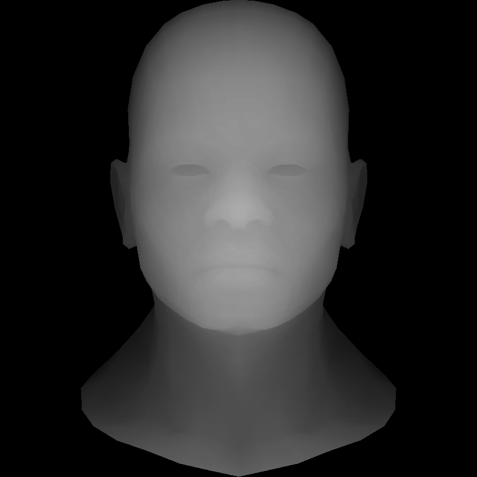

# TinyRenderer-CN

| 作者 | ssloy       |
| --- |-------------|
| 翻译 | zouchanglin |
| 校对 | 无           |

## lesson3-消除隐藏面（ZBuffer算法）
### 前言
你好，让我给你介绍一下我的一个黑人朋友 `z-buffer` 。他将帮助我们摆脱上一节课中无法消除遮挡面的问题。

顺便提一下，我在课程中大量使用的这个模型是由 Vidar Rapp 创建的。他授权我使用它来教授渲染基础知识，虽然我破坏了它，但我保证你后面会逐步复原它。

好吧回到主题，理论上我们可以画出所有的三角形。如果我们正确地从后到前开始，前面的刻面将擦除后面的刻面。它被称为画家算法，不幸的是，它伴随着高计算成本：对于每个摄像机移动，我们需要重新排序所有场景。然后甚至是动态场景…… 这甚至不是主要问题，主要问题是确定正确的顺序不是固定的。
