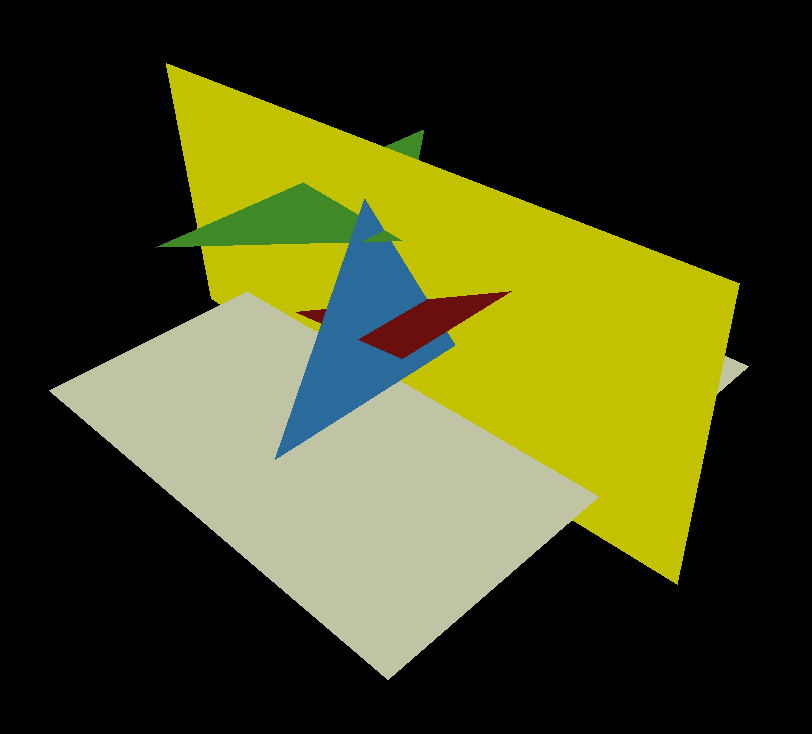
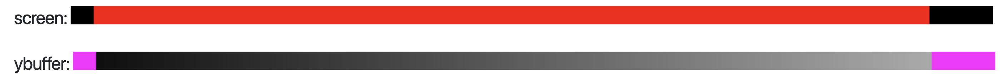
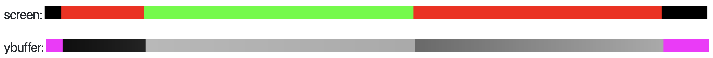
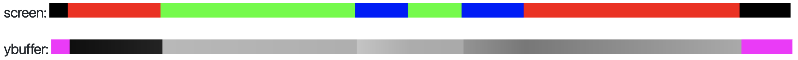
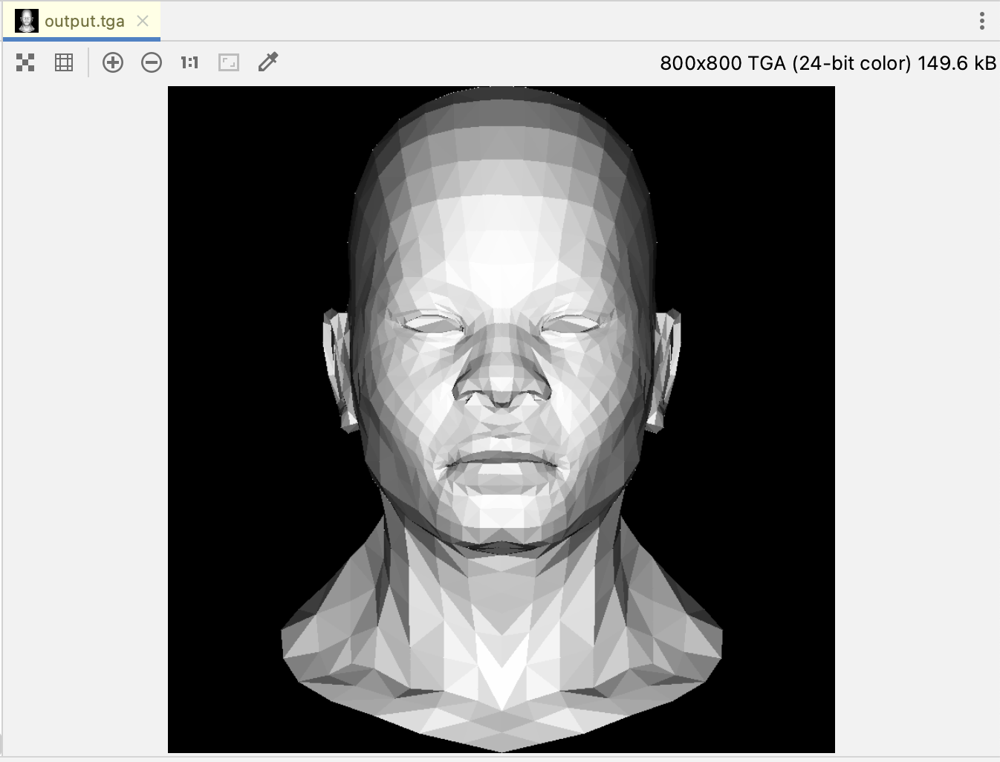
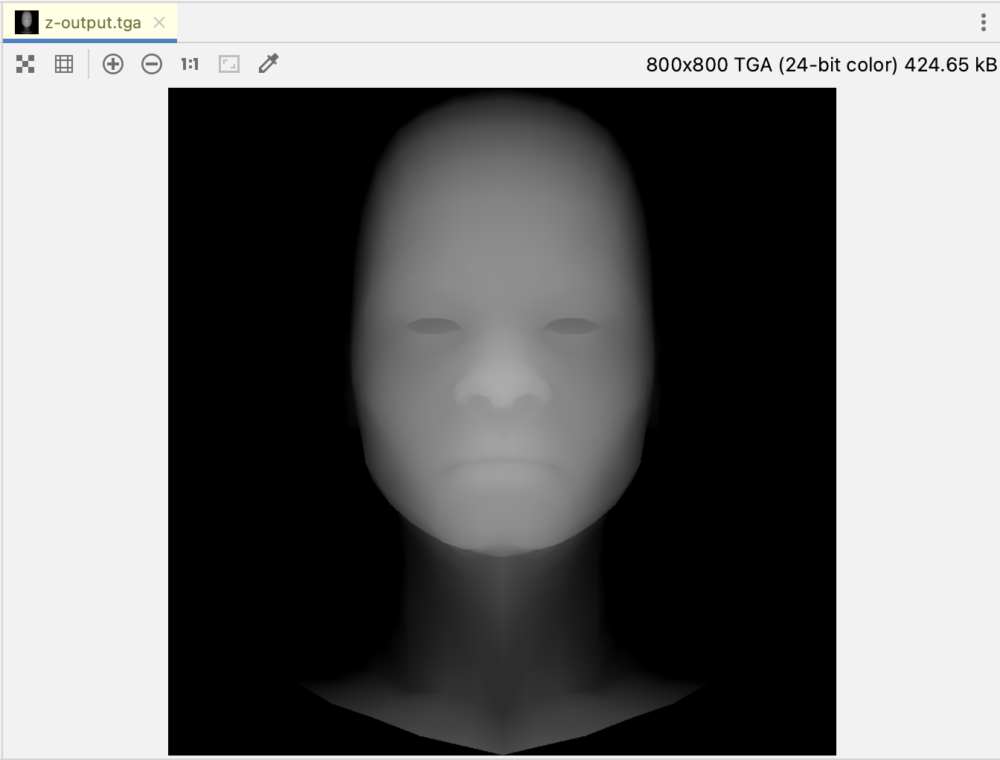
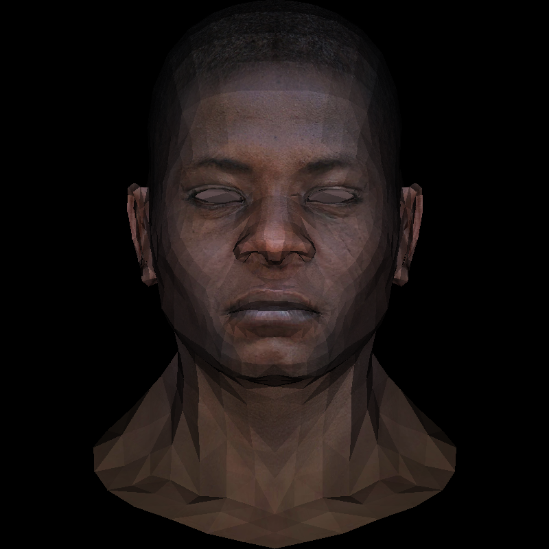

# TinyRenderer-CN

| 作者 | ssloy       |
| --- |-------------|
| 翻译 | zouchanglin |
| 校对 | 无           |

## lesson3-消除隐藏面（ZBuffer算法）
### 前言
你好，让我给你介绍一下我的一个黑人朋友 `z-buffer` 。他将帮助我们摆脱上一节课中无法消除遮挡面的问题。


顺便提一下，我在课程中大量使用的这个模型是由 Vidar Rapp 创建的。他授权我使用它来教授渲染基础知识，虽然我破坏了它，但我保证你后面会逐步复原它。

好吧回到主题，理论上我们可以画出所有的三角形。如果我们正确地从后到前开始，前面的刻面将擦除后面的刻面。它被称为画家算法，不幸的是，它伴随着高计算成本：对于每个摄像机移动，我们需要重新排序所有场景。然后甚至是动态场景…… 这甚至不是主要问题，主要问题是确定正确的顺序不是固定的。

### 尝试渲染简单场景

想象一个由三个三角形组成的简单场景: 相机向上向下看，我们将彩色的三角形投射到白色屏幕上:


渲染出来的结果应该像这样：

蓝色面应该是在红色面的后面还是前面呢？我们发现画家算法在这里无法处理。可以将蓝色面一分为二（一个在红色面前面，一个在后面）。然后再将红色三角形前面的那个一分为二，一个在绿色三角形前面，一个在绿色三角形后面…… 我想你明白问题所在了：在有数百万个三角形的场景中，计算起来就非常困难了。可以使用 [BSP树(二分空间分割树)](https://en.wikipedia.org/wiki/Binary_space_partitioning) 来解决这个问题。 顺便说一句，这个数据结构常用于移动摄像机，但是真的会很复杂。人生苦短！

### 从简单的开始: 降一个维度，Y-buffer
让我们暂时丢弃一个维度，沿着黄色平面剪掉上面的场景:

我的意思是，现在我们的场景中有三条线段(即黄色面与每个三角形的交线)，最终渲染单位宽度，1像素高度：

和往常一样，这个 [commit](https://github.com/ssloy/tinyrenderer/tree/d9c4b14c0d8c385937bc87cee1178f1e42966b7c) 也可以看看。我们的场景是二维的，所以很容易用第一节中的 line() 函数绘制。

```c++
{   // 我们跳转到二维场景 
    TGAImage scene(width, height, TGAImage::RGB);

    // scene "2d mesh"
    line(Vec2i(20, 34),   Vec2i(744, 400), scene, red);
    line(Vec2i(120, 434), Vec2i(444, 400), scene, green);
    line(Vec2i(330, 463), Vec2i(594, 200), scene, blue);

    // screen line
    line(Vec2i(10, 10), Vec2i(790, 10), scene, white);

    scene.flip_vertically(); // i want to have the origin at the left bottom corner of the image
    scene.write_tga_file("scene.tga");
}
```
这就是我们的场景的2D侧视图：

让我们开始吧，渲染单位宽度，也就是1像素高度。在我的源码中，我创建了16像素高的图像，以便于在高分辨率屏幕上观察。 rasterize() rasterize() 函数只会对图像中第一行进行颜色写入。
```c++
TGAImage render(width, 16, TGAImage::RGB);
int ybuffer[width];
for (int i = 0; i < width; i++) {
  ybuffer[i] = std::numeric_limits<int>::min();
}
rasterize(Vec2i(20, 34), Vec2i(744, 400), render, red,   ybuffer);
rasterize(Vec2i(120, 434), Vec2i(444, 400), render, green, ybuffer);
rasterize(Vec2i(330, 463), Vec2i(594, 200), render, blue,  ybuffer);
```
我创建了一个维度为 (width, 1) 的魔法数组 y-buffer，这个数组的元素均用负无穷整数初始化。随后调用了 rasterize() 函数，将这个渲染对象作为参数传入。

```c++
void rasterize(Vec2i p0, Vec2i p1, TGAImage &image, TGAColor color, int ybuffer[]) {
    if (p0.x > p1.x) {
        std::swap(p0, p1);
    }
    for (int x = p0.x; x <= p1.x; x++) {
        float t = (x - p0.x) / (float)(p1.x - p0.x);
        int y = p0.y * (1. - t) + p1.y * t;
        if (ybuffer[x] < y) {
            ybuffer[x] = y;
            image.set(x, 0, color);
        }
    }
}
```

这相当简单：我遍历 p0.x 和 p1.x 之间所有的 x 坐标，计算片段内相应的 y 坐标，然后检查当前 y-buffer 数组中 x 下标对应的元素。如果当前 y 值比 y-buffer 中 y 值更接近摄像机，那就把这个像素绘制到屏幕上，同时更新 y-buffer。
> 译者注: 可能大家会疑惑 float t 是什么，其实再图形学领域，这种计算的出 t 本质就是p1.x 和 p0.x的重心坐标，也叫做线型插值，简单来看就是一个点在两点之间，那么这个点的属性会收到哪一个点的影响更大，本质就是计算权重而已。
> 

接下来看看每一步会呈现什么样的 y-buffer。在调用第一个 rasterize() ，绘制红色线段后，内存中是这样的：



这里洋红色表示负无穷大，用于对应于我们屏幕中没有任何内容的地方。所有其余部分都以灰色阴影显示：浅色说明靠近相机，深色说明远离相机。
然后，我们绘制绿色线段：

最后，我们绘制蓝色线段：

哈哈，我们刚刚在一维屏幕上画了一个2D场景! 让我们再次欣赏一下渲染效果:


### 回到3D的场景
在 2D 屏幕上绘制，那 z-buffer 也必须是二维的：
```cpp
int *zbuffer = new int[width * height];
```
对于我个人而言，我喜欢把二维数组抽象成一维的（其实本质也是一维数组），转换很简单：
```cpp
int index = x + y * width;
```
逆转换：
```cpp
int x = idx % width;
int y = idx / width;
```
然后在代码中我遍历所有三角形并把当前三角形和 z-buffer 的引用传入rasterizer函数

唯一的困难是如何计算我们要绘制的像素的 z 值。 让我们回忆一下我们是如何计算 y 缓冲区示例中的 y 值的：

```cpp
int y = p0.y * (1. - t) + p1.y * t;
```
t 的本质是什么？ $(1-t, t)$ 是用线段端点 p0 p1 表示的点 (x, y) 的重心坐标： $p0 * (1 - t) + p1 * t$ 。所以关键是获取三角形的重心坐标，然后用重心坐标乘三角形三个顶点的 z 值，计算出当前我们要绘制像素的 z 值：

```cpp
triangle(screen_coords, float *zbuffer, image, TGAColor(intensity*255, intensity*255, intensity*255, 255));

[...]

void triangle(Vec3f *pts, float *zbuffer, TGAImage &image, TGAColor color) {
    Vec2f bboxmin( std::numeric_limits<float>::max(),  std::numeric_limits<float>::max());
    Vec2f bboxmax(-std::numeric_limits<float>::max(), -std::numeric_limits<float>::max());
    Vec2f clamp(image.get_width()-1, image.get_height()-1);
    for (int i=0; i<3; i++) {
        for (int j=0; j<2; j++) {
            bboxmin[j] = std::max(0.f,      std::min(bboxmin[j], pts[i][j]));
            bboxmax[j] = std::min(clamp[j], std::max(bboxmax[j], pts[i][j]));
        }
    }
    Vec3f P;
    for (P.x=bboxmin.x; P.x<=bboxmax.x; P.x++) {
        for (P.y=bboxmin.y; P.y<=bboxmax.y; P.y++) {
            Vec3f bc_screen  = barycentric(pts[0], pts[1], pts[2], P);
            if (bc_screen.x<0 || bc_screen.y<0 || bc_screen.z<0) continue;
            P.z = 0;
            for (int i=0; i<3; i++) P.z += pts[i][2]*bc_screen[i];
            if (zbuffer[int(P.x+P.y*width)]<P.z) {
                zbuffer[int(P.x+P.y*width)] = P.z;
                image.set(P.x, P.y, color);
            }
        }
    }
}
```
我们对上节课的源码进行了很少的改动以丢弃隐藏部分，这真是太棒了！这是渲染结果：

> 译者注：同时我们也可以看看对应的深度图的样子

全部的代码如下：
```cpp
#include <vector>
#include <cstdlib>
#include <limits>
#include "tgaimage.h"
#include "model.h"
#include "geometry.h"

const int width  = 800;
const int height = 800;

const TGAColor white = TGAColor(255, 255, 255, 255);
const TGAColor red = TGAColor(255, 0,   0,   255);
const TGAColor green = TGAColor(0, 255,   0,   255);

Vec3f barycentric(Vec3f A, Vec3f B, Vec3f C, Vec3f P) {
    Vec3f s[2];
    for (int i=2; i--; ) {
        s[i][0] = C[i]-A[i];
        s[i][1] = B[i]-A[i];
        s[i][2] = A[i]-P[i];
    }
    Vec3f u = cross(s[0], s[1]);
    if (std::abs(u[2])>1e-2) {
        return {1.f-(u.x+u.y)/u.z, u.y/u.z, u.x/u.z};
    }
    return {-1,1,1};
}

float min(float a, float b){
    return a < b ? a:b;
}

float max(float a, float b){
    return a > b ? a:b;
}

void triangle(Vec3f *pts, float *zBuffer, TGAImage &image, TGAColor color, TGAImage &zimage) {
    Vec2f bBoxMin(std::numeric_limits<float>::max(), std::numeric_limits<float>::max());
    Vec2f bBoxMax(-std::numeric_limits<float>::max(), -std::numeric_limits<float>::max());
    Vec2i clamp(image.get_width() - 1, image.get_height() - 1);
    for (int i = 0; i < 3; i++) {
        for (int j = 0; j < 2; j++) {
            bBoxMin[j] = max(0.f, min(bBoxMin[j], pts[i][j]));
            bBoxMax[j] = min(clamp[j], max(bBoxMax[j], pts[i][j]));
        }
    }
    Vec3f P;
    for (P.x = bBoxMin.x; P.x <= bBoxMax.x; P.x++) {
        for (P.y = bBoxMin.y; P.y <= bBoxMax.y; P.y++) {
            Vec3f bc_screen = barycentric(pts[0], pts[1], pts[2], P);
            if (bc_screen.x < 0 || bc_screen.y < 0 || bc_screen.z < 0) continue;
            P.z = 0;
            for (int i = 0; i < 3; i++) P.z += pts[i][2]*bc_screen[i];
            if (zBuffer[int(P.x + P.y * width)] < P.z) {
                zBuffer[int(P.x + P.y * width)] = P.z;
                image.set(P.x, P.y, color);
                // 顺便绘制一下深度图
                zimage.set(P.x, P.y, white * P.z);
            }
        }
    }
}

Vec3f world2screen(Vec3f v) {
    return Vec3f(int((v.x + 1.) * width/2. + .5), int((v.y + 1.) * height/2. + .5), v.z);
}

int main(int argc, char* argv[]){
    Model *model;
    if (2 == argc) {
        model = new Model(argv[1]);
    } else {
        model = new Model("../obj/african_head.obj");
    }
    TGAImage image(width, height, TGAImage::RGB);
    TGAImage zImage(width, height, TGAImage::RGBA);

    // init z-buffer
    auto *zBuffer = new float[width * height];
    for (int i=width * height; i--; zBuffer[i] = -std::numeric_limits<float>::max());

    Vec3f light_dir(0, 0, -1);
    for (int i = 0; i < model->nfaces(); i++) {
        std::vector<int> face = model->face(i);
        Vec3f pts[3];
        Vec3f world_coords[3];
        for (int j = 0; j < 3; j++) {
            pts[j] = world2screen(model->vert(face[j]));
            world_coords[j] = model->vert(face[j]);
        }

        Vec3f n = (world_coords[2] - world_coords[0])^(world_coords[1] - world_coords[0]);
        n.normalize();

        int intensity = (int)(n * light_dir * 255);
//        triangle(pts, zBuffer, image, TGAColor(rand()%255, rand()%255, rand()%255, 255));
        triangle(pts, zBuffer, image, TGAColor(intensity, intensity, intensity, 255), zImage);
    }

    image.flip_vertically();
    image.write_tga_file("output.tga");

    zImage.flip_vertically();
    zImage.write_tga_file("z-output.tga");

    delete model;
    return 0;
}
```
## 除了深度插值，还能做些什么？

我将布置一个家庭作业： 实现纹理插值

在这里我们有必要解释一下模型文件的其他的组成部分，也就是对.obj 文件格式的简单说明：

```
v -0.609326 -0.569868 -0.41571
```
v 即 vertex，表示这个顶点的 3D 坐标 x, y, z

```
vt  0.511 0.472 0.000
```
vt 即 vertex texture，表示纹理坐标 uvt，一般 3D 模型只需要 2D 纹理，所以第三个分量一般是 0

```
vn  0.911 -0.129 -0.391
```
vn 即 vertex normal，表示一个顶点的法线，用于计算光照

```
f 106/83/106 107/84/107 108/85/108
```
f 即 face，后跟的三组数字代表多边形的顶点，这里给出的是三个顶点，故为三角形。每组数字依次表示 `位置v编号/纹理坐标vt编号/法线vn编号`，编号即 v、vt、vn 在 obj 文件中的出现顺序，从 1 开始计算

对应的漫反射贴图在这里可以找到 [african_head_diffuse.tga](https://github.com/ssloy/tinyrenderer/raw/master/obj/african_head/african_head_diffuse.tga)

你如果顺利完成的话看到的图应该和下面一致：



> 下面是译者的实现：（注意 model.h 和 model.cpp 升级了，目前添加了纹理坐标、法线的读取）

```cpp
#include <vector>
#include <cstdlib>
#include <limits>
#include "tgaimage.h"
#include "model.h"
#include "geometry.h"

const int width  = 800;
const int height = 800;

const TGAColor white = TGAColor(255, 255, 255, 255);
const TGAColor red = TGAColor(255, 0,   0,   255);
const TGAColor green = TGAColor(0, 255,   0,   255);

Vec3f barycentric(Vec3f A, Vec3f B, Vec3f C, Vec3f P) {
    Vec3f s[2];
    for (int i=2; i--; ) {
        s[i][0] = C[i]-A[i];
        s[i][1] = B[i]-A[i];
        s[i][2] = A[i]-P[i];
    }
    Vec3f u = cross(s[0], s[1]);
    if (std::abs(u[2])>1e-2) {
        return {1.f-(u.x+u.y)/u.z, u.y/u.z, u.x/u.z};
    }
    return {-1,1,1};
}

float min(float a, float b){
    return a < b ? a:b;
}

float max(float a, float b){
    return a > b ? a:b;
}

void triangle(Vec3f *pts, float *zBuffer, TGAImage &image, TGAColor color, TGAImage &zimage) {
    Vec2f bBoxMin(std::numeric_limits<float>::max(), std::numeric_limits<float>::max());
    Vec2f bBoxMax(-std::numeric_limits<float>::max(), -std::numeric_limits<float>::max());
    Vec2i clamp(image.get_width() - 1, image.get_height() - 1);
    for (int i = 0; i < 3; i++) {
        for (int j = 0; j < 2; j++) {
            bBoxMin[j] = max(0.f, min(bBoxMin[j], pts[i][j]));
            bBoxMax[j] = min(clamp[j], max(bBoxMax[j], pts[i][j]));
        }
    }
    Vec3f P;
    for (P.x = bBoxMin.x; P.x <= bBoxMax.x; P.x++) {
        for (P.y = bBoxMin.y; P.y <= bBoxMax.y; P.y++) {
            Vec3f bc_screen = barycentric(pts[0], pts[1], pts[2], P);
            if (bc_screen.x < 0 || bc_screen.y < 0 || bc_screen.z < 0) continue;
            P.z = 0;
            for (int i = 0; i < 3; i++) P.z += pts[i][2]*bc_screen[i];
            if (zBuffer[int(P.x + P.y * width)] < P.z) {
                zBuffer[int(P.x + P.y * width)] = P.z;
                image.set(P.x, P.y, color);
                // 顺便绘制一下深度图
                zimage.set(P.x, P.y, white * P.z);
            }
        }
    }
}

Vec3f world2screen(Vec3f v) {
    return Vec3f(int((v.x + 1.) * width/2. + .5), int((v.y + 1.) * height/2. + .5), v.z);
}

int main(int argc, char* argv[]){

    TGAImage diffuseTexture = TGAImage();
    bool readRet = diffuseTexture.read_tga_file("../obj/african_head_diffuse.tga");
    if(!readRet) {
        std::cerr << "readRet not exist" << std::endl;
        return -1;
    }

    Model *model;
    if (2 == argc) {
        model = new Model(argv[1]);
    } else {
        model = new Model("../obj/african_head.obj",
                          "../obj/african_head_diffuse.tga",
                          nullptr,
                          nullptr);
    }
    TGAImage image(width, height, TGAImage::RGB);
    TGAImage zImage(width, height, TGAImage::GRAYSCALE);

    // init z-buffer
    auto *zBuffer = new float[width * height];
    for (int i=width * height; i--; zBuffer[i] = -std::numeric_limits<float>::max());

    Vec3f light_dir(0, 0, -1);


    for (int i = 0; i < model-> nfaces(); i++) {
        std::vector<int> face = model->face(i);
        Vec3f pts[3];
        Vec3f world_coords[3];
        Vec2f uvs[3];
        TGAColor colors[3];
        for (int j = 0; j < 3; j++) {
            pts[j] = world2screen(model->vert(face[j]));
            world_coords[j] = model->vert(face[j]);
            // 获得UV偏移
            uvs[j] = model->uv(i,j);

            colors[j] = model->diffuse(model->uv(i, j));
//            std::cout << "colors[j].bgra = " << (int)colors[j].bgra[2] << ", " << (int)colors[j].bgra[1] << ", " << (int)colors[j].bgra[0] << std::endl;
        }

//        int i1 = colors[0].bgra[2];
        TGAColor final_color = TGAColor((colors[0].bgra[2] + colors[1].bgra[2] + colors[2].bgra[2])/3,
                                        (colors[0].bgra[1] + colors[1].bgra[1] + colors[2].bgra[1])/3,
                                        (colors[0].bgra[0] + colors[1].bgra[0] + colors[2].bgra[0])/3,
                                        255);

        std::cout << "final_color = " << (int)final_color.bgra[2] << ", " << (int)final_color.bgra[1] << ", " << (int)final_color.bgra[0] << std::endl;
        Vec3f n = (world_coords[2] - world_coords[0])^(world_coords[1] - world_coords[0]);
        n.normalize();

        float intensity = n * light_dir;
//        triangle(pts, zBuffer, image, TGAColor(rand()%255, rand()%255, rand()%255, 255), zImage);
//        triangle(pts, zBuffer, image, TGAColor(intensity, intensity, intensity, 255), zImage);

        TGAColor color = TGAColor(final_color.bgra[2], final_color.bgra[1],
                                         final_color[0], 255);
        std::cout << "color = " << (int)color.bgra[2] << ", " << (int)color.bgra[1] << ", " << (int)color.bgra[0] << std::endl;
        if(intensity > 0){
            triangle(pts, zBuffer, image, color, zImage);
        }
    }

    image.flip_vertically();
    image.write_tga_file("output.tga");

    zImage.flip_vertically();
    zImage.write_tga_file("z-output.tga");

    delete model;
    return 0;
}
```