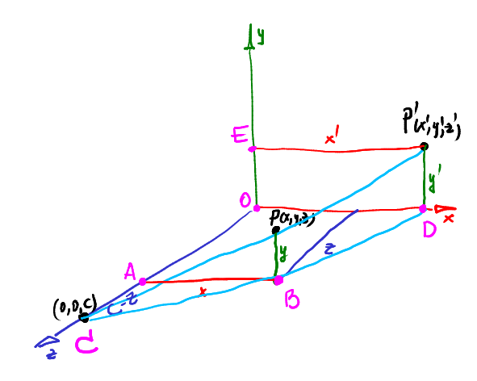

# TinyRenderer-CN

| 作者 | ssloy       |
| --- |-------------|
| 翻译 | zouchanglin |
| 校对 | 无           |

## lesson4-投影变换
### 目标
在之前的课程中，我们通过简单地忽略 z 坐标来在正交投影中渲染我们的模型。今天的目标是学习如何透视投影：


### 2D线性变换 Linear transformations
一个平面上的线性变换，可以用相应的矩阵表示。假设已知点 (x, y)，然后要对其变换，可以写为：

$$ 
\left[\begin{array}{ll}
a & b \\
c & d
\end{array}\right]\left[\begin{array}{l}
x \\
y
\end{array}\right]=\left[\begin{array}{l}
a x+b y \\
c x+d y
\end{array}\right]
$$

最简单的变换(不考虑降维)是恒等变换，这种变换没有移动任何点：

$$ 
\left[\begin{array}{ll}
1 & 0 \\
0 & 1
\end{array}\right]\left[\begin{array}{l}
x \\
y
\end{array}\right]=\left[\begin{array}{l}
x \\ y
\end{array}\right]
$$

矩阵对角线上的系数，施加的效果就是沿坐标轴的缩放。用图描述，如果我们采取下面的矩阵：

$$ 
\left[\begin{array}{ll}
3/2 & 0 \\
0 & 3/2
\end{array}\right]\left[\begin{array}{l}
x \\
y
\end{array}\right]=\left[\begin{array}{l}
3/2x \\ 3/2y
\end{array}\right]
$$

白色物体（切掉一个角的白色正方形）将变成黄色物体。 红色和绿色线段分别给出与 x 和 y 对齐的单位长度向量：


所有的图像，都是用 [这个代码](https://github.com/ssloy/tinyrenderer/blob/a175be75a8a9a773bdfae7543a372e3bc859e02f/main.cpp) 生成的。

为什么要用矩阵？原因有二。首先，可以很方便的描述对整个物体的变换，像这样：

$$
\left[\begin{array}{cc}
3 / 2 & 0 \\
0 & 3 / 2
\end{array}\right]\left[\begin{array}{ccccc}
-1 & 1 & 1 & 0 & -1 \\
-1 & -1 & 0 & 1 & 1
\end{array}\right]=\left[\begin{array}{ccccc}
-3 / 2 & 3 / 2 & 3 / 2 & 0 & -3 / 2 \\
-3 / 2 & -3 / 2 & 0 & 3 / 2 & 3 / 2
\end{array}\right]
$$

这个表达式中变换矩阵跟之前的一样，2x5 矩阵内的是方形物体的顶点。简单地把所有顶点放到数组里，乘一个变换矩阵，最后得到变换后的物体，够酷吧？

还有一个潜在的真正原因：大多情况下需要在一行代码里多次变换我们的物体。想象你写了这样变换代码的函数：

```cpp
vec2 foo(vec2 p) return vec2(ax+by, cx+dy);
vec2 bar(vec2 p) return vec2(ex+fy, gx+hy);
[..]
for (each p in object) {
    p = foo(bar(p));
}
```

上面的代码对每个物体的每个顶点进行两次线性变换，但是通常情况下我们有百万级的顶点，就连一行代码包含几十次变换都不是什么稀罕事，最终有数百万次计算，这太奢侈了。如果使用矩阵，我们可以对所有变换进行矩阵计算，一次将物体变换完毕。只要在一个连乘的表达式中的合适位置加上括号，就好了。

> 译者注：同样这也是矩阵的意义，因为通常来讲用一个向量就可以表示单次的线性变换，多个向量组合成矩阵自然也就表达了多次线性变换的过程！

我们已经知道了，矩阵对角线上的系数可以沿坐标轴缩放任何物体，其他系数有什么含义呢？思考下边这个变换：

$$
\left[\begin{array}{cc}
1 & 1 / 3 \\
0 & 1
\end{array}\right]\left[\begin{array}{l}
x \\
y
\end{array}\right]=\left[\begin{array}{c}
x+y / 3 \\
y
\end{array}\right]
$$

将此矩阵表示的变换应用在图像上会是下面的样子：


这是一个沿 x 轴的简单剪切，另一个斜对角线系数则沿着 y 轴剪切。因此，平面上有两种基础的线性变换：缩放、剪切。很多人会问：慢着，旋转呢？

事实证明，任何围绕原点的旋转都可以表示为三个剪切的复合动作，这里白色对象转换为红色对象，然后转换为绿色对象，最后转换为蓝色对象：


但这些都是错综复杂的细节，为了简单起见，可以直接写一个旋转矩阵（你还记得预计算的技巧吗？）：

$$
\left[\begin{array}{cc}
\cos (\alpha) & -\sin (\alpha) \\
\sin (\alpha) & \cos (\alpha)
\end{array}\right]\left[\begin{array}{l}
x \\
y
\end{array}\right]=\left[\begin{array}{l}
x \cos (\alpha)-y \sin (\alpha) \\
x \sin (\alpha)+y \cos (\alpha)
\end{array}\right]
$$

矩阵可以按任何顺序乘，但记住，矩阵乘法没有交换律：

$$
\left[\begin{array}{cc}
\cos (\alpha) & -\sin (\alpha) \\
\sin (\alpha) & \cos (\alpha)
\end{array}\right] \times\left[\begin{array}{cc}
1 & 1 / 3 \\
0 & 1
\end{array}\right]=\left[\begin{array}{ccc}
\cos (\alpha) & 1 / 3 \cos (\alpha)-\sin (\alpha) \\
\sin (\alpha) & \cos (\alpha)+1 / 3 \sin (\alpha)
\end{array}\right] \neq\left[\begin{array}{cc}
1 & 1 / 3 \\
0 & 1
\end{array}\right] \times\left[\begin{array}{ccc}
\cos (\alpha) & -\sin (\alpha) \\
\sin (\alpha) & \cos (\alpha)
\end{array}\right]=\left[\begin{array}{cc}
\cos (\alpha)+1 / 3 \sin (\alpha) & 1 / 3 \cos (\alpha)-\sin (\alpha) \\
\sin (\alpha) & \cos (\alpha)
\end{array}\right]
$$

其实道理很简单：剪切一个物体，然后旋转它不等于旋转它，然后剪切它！

### 2D 仿射变换

所以平面上的任何线性变换都是缩放和剪切变换的组合。这意味着我们可以做任何我们想要的线性变换，原点永远不会移动！

这种表示方法可能很有用，但我们却不能描述出简单的位移，不够爽吧？ 因为位移并不是线性的，没关系，让我们在线性变换部分的后面加上能表示位移的变换：

$$
\left[\begin{array}{ll}
a & b \\
c & d
\end{array}\right]\left[\begin{array}{l}
x \\
y
\end{array}\right]+\left[\begin{array}{l}
e \\
f
\end{array}\right]=\left[\begin{array}{l}
a x+b y+e \\
c x+d y+f
\end{array}\right]
$$

这个表达式就完美了。我们可以旋转、缩放、移动。这里是两个变换复合后的样子(记住，实际上我们需要 N 多个这样的组合)：

$$
\left[\begin{array}{ll}
a_{2} & b_{2} \\
c_{2} & d_{2}
\end{array}\right]\left(\left[\begin{array}{ll}
a_{1} & b_{1} \\
c_{1} & d_{1}
\end{array}\right]\left[\begin{array}{l}
x \\
y
\end{array}\right]+\left[\begin{array}{l}
e_{1} \\
f_{1}
\end{array}\right]\right)+\left[\begin{array}{l}
e_{2} \\
f_{2}
\end{array}\right]
$$

尽管是一个简单的符合变换，添加完位移部分之后，它还是变得更丑了。

### 引入齐次坐标

现在是见证奇迹的时候了，想象一下，往我们的变换矩阵中添加一行一列(变成 3x3 矩阵)，然后往向量中添加一个永远为 1 的分量，来参与变换：

$$
\left[\begin{array}{lll}
a & b & e \\
c & d & f \\
0 & 0 & 1
\end{array}\right]\left[\begin{array}{l}
x \\
y \\
1
\end{array}\right]=\left[\begin{array}{c}
a x+b y+e \\
c x+d y+f \\
1
\end{array}\right]
$$

让向量左乘这个矩阵，我们会得到最后一个分量是 1 的另一个向量，但其他两个分量就是我们需要的了！

这里边的思想很简单。在 2D 平面上，平移变换不是线性的，所以我们通过简单地把 1 添加为第三个分量，将 2D 升维 3D空间。这意味着之前的 2D 平面重合于 3D 空间的 `z=1` 平面。随后，我们进行 3D 线性变换，最后把结果投影回 2D 平面。平移变换还是非线性的，但这种处理方式很简单。

3D 空间中的向量是如何投影回 2D 平面的？让其他分量除以第三个分量：

$$
\left[\begin{array}{l}
x \\
y \\
z
\end{array}\right] \rightarrow\left[\begin{array}{l}
x / z \\
y / z
\end{array}\right]
$$

### 别急，别忘记除零的情况
回想一下之前的处理方式：

我们把 2D 平面放到 3D 空间中的 z=1 面上

在 3D 空间中做我们任何想做的事

对于我们想要从3D 投影到2D 的每一个点，我们在原点和要投影的点之间画一条直线，然后我们找到它与平面 z = 1的交点。

在这张图中，我们的 2D 平面用洋红色表示，(x, y, z) 点被投影成 (x/z, y/z)：


设想有一条经过 (x, y, 1) 的竖直的线，哪些点能被投影到 (x, y, 1)？(x, y)


现在往竖线下方看，点 (x, y, 1/2) 会被投影到 (2x, 2y)：


继续，点 (x, y, 1/4) 投影成 (4x, 4y)：


如果继续下去，当 z 接近 0 时，投影结果会沿 `(x, y)` 方向距离原点越来越远。换句话说， `(x, y, 0)` 被投影到无限远，这是啥？对喽，这就是一个平淡无奇的向量。

齐次坐标系中，点和向量是可以区分的。如果一个程序员写了 `vec2(x, y)`，这是向量还是点？很难说。在齐次坐标下，所有 z=0 的都是向量，其余的都是点。瞧：`vector + vector = vector`，`vector - vector = vector`，`point + vector = point`。完美契合向量和点的运算规律。

> 译者注：关于这一点，其实我在 [《向量与线性代数、变换》](https://zouchanglin.cn/3359514351.html) 里面有提到，读者可以参考理解


#### 复合变换
就如我之前说的，我们能合并几十个变换矩阵的运算。为什么？让我们想象一下，我们需要围绕一个点(x0，y0)旋转一个物体(2D)。怎么做？可以找到一些现成的公式，或者我们可以手动推导，我们有所有需要的工具！

我们了解绕原点旋转，了解如何位移，这就够了：将 (x0, y0) 移动到原点，绕原点旋转，再平移回去：

$$
M=\left[\begin{array}{ccc}
1 & 0 & x_{0} \\
0 & 1 & y_{0} \\
0 & 0 & 1
\end{array}\right]\left[\begin{array}{ccc}
\cos (\alpha) & -\sin (\alpha) & 0 \\
\sin (\alpha) & \cos (\alpha) & 0 \\
0 & 0 & 1
\end{array}\right]\left[\begin{array}{ccc}
1 & 0 & -x_{0} \\
0 & 1 & -y_{0} \\
0 & 0 & 1
\end{array}\right]
$$

在 3D 空间中的一系列变换可能会用更长的式子来表达，但关键内容是一样的：我们需要知道基础变换，就能表示出任意符合变换。

### 别急，还有3D仿射变换
当然！把下面的变换矩阵应用到我们之前的正方形物体上：

$$
\left[\begin{array}{ccc}
1 & 0 & 0 \\
0 & 1 & 0 \\
-1 / 5 & 0 & 1
\end{array}\right]
$$

原始物体是白色的，单位向量是红色和绿色的：


这就是变换后的物体：


这里还有另一种魔法(白色!)发生了。你还记得我们的 Y-buffer 练习吗？在这里我们将做同样的事情: 我们将我们的2D 对象投影到垂直线 `x = 0`上。让我们稍微强化一下规则: 我们必须使用一个中心投影，我们的相机是在点`(5,0)` ，并指向原点。为了找到投影，我们需要跟踪摄像机和投影点之间的直线(黄色) ，并找到与屏幕线(白色垂直)的交点。

现在我用转换后的物体替换原来的物体，但是我没有动我们之前画的黄线:


如果我们使用标准的正交投影将红色对象投影到屏幕上，那么我们会找到完全相同的点！让我们仔细观察一下这种转换是如何工作的: 所有竖直的线段被原封不动投影到竖直白线上，但是那些靠近摄像机的部分被拉伸，而那些远离摄像机的部分被缩小。如果我们选择的系数正确(在我们的变换矩阵是 `-1/5`系数) ，我们得到一个透视(中心)投影图像！

### 是时候考虑完整的 3D 情况了

让我们来解释一下刚发生的奇迹时刻，对于二维仿射变换、三维仿射变换，我们将使用齐次坐标: 一个点`(x，y，z)` 表示为 `(x，y，z，1)`增加，然后我们将它变换为四维并投影回三维。例如，如果我们采用如下变换：

$$
\left[\begin{array}{llll}
1 & 0 & 0 & 0 \\
0 & 1 & 0 & 0 \\
0 & 0 & 1 & 0 \\
0 & 0 & r & 1
\end{array}\right]\left[\begin{array}{l}
x \\
y \\
z \\
1
\end{array}\right]=\left[\begin{array}{c}
x \\
y \\
z \\
r z+1
\end{array}\right]
$$

反向投影会得到这样的 3D 坐标：

$$
\left[\begin{array}{c}
x \\
y \\
z \\
r z+1
\end{array}\right] \rightarrow\left[\begin{array}{c}
\frac{x}{r z+1} \\
\frac{y}{r z+1} \\
\frac{z}{r z+1}
\end{array}\right]
$$


让我们记住这个结果，但暂时把它放在一边。让我们回到中心投影的标准定义，先不考虑 4D 变换这种任何花哨的东西。给定一个点 `P = (x，y，z)` ，我们想把它投影到平面 `z = 0` 上，摄像机在 z 轴上的点`(0, 0, c)` :


三角形 ABC 和 ODC 是相似的，可以得出：`|AB|/|AC| = |OD| /|OC|`，即 `x/(c-z) = x'/c`，变换一下顺序：

$$
x'=  \frac {x}{1-z/c} 
$$

对 CPB 和 `CP'D` 做同样的操作，很容易得出下边的表达式

$$
y'=  \frac {y}{1-z/c} 
$$

这个结果和我们放在前面的结果非常相似，但是我们只用了一个矩阵乘法就得到了这个结果。我们得到了系数的定律: `r = -1/c`。

### 让我们总结一下: 今天的主要公式
*如果你只是简单地复制粘贴这个公式而不理解上述材料，我鄙视你。*

$$
\left[\begin{array}{l}
x \\
y \\
z
\end{array}\right] \rightarrow\left[\begin{array}{l}
x \\
y \\
z \\
1
\end{array}\right]
$$

$$
\left[\begin{array}{cccc}
1 & 0 & 0 & 0 \\
0 & 1 & 0 & 0 \\
0 & 0 & 1 & 0 \\
0 & 0 & -1 / c & 1
\end{array}\right]\left[\begin{array}{c}
x \\
y \\
z \\
1
\end{array}\right]=\left[\begin{array}{c}
x \\
y \\
z \\
1-z / c
\end{array}\right]
$$


$$
\left[\begin{array}{c}
x \\
y \\
z \\
1-z / c
\end{array}\right] \rightarrow
\left[\begin{array}{c}
\frac{x}{1-z / c} \\
\frac{y}{1-z / c} \\
\frac{z}{1-z / c}
\end{array}\right]
$$

我们以某种方式变换我们的对象，简单地忘记它的z坐标，我们将得到一个透视视图。如果我们想要使用z-buffer，那么自然不要忘记 z 坐标。代码可以在 [这里](https://github.com/ssloy/tinyrenderer/tree/1cce85258d1f1cf75fd10fe4d62ebfdb669f8cf9) 找到，其结果可以在本文的开头看到。

快速修复C++14/17下的一个编译错误：
在 geometry.cpp, 改动如下：
```cpp
template <> template <> Vec3<int>::Vec3<>(const Vec3<float> &v) : x(int(v.x+.5)), y(int(v.y+.5)), z(int(v.z+.5)) {}
template <> template <> Vec3<float>::Vec3<>(const Vec3<int> &v) : x(v.x), y(v.y), z(v.z) {}
```

更改为
```cpp
template <> template <> Vec3<int>::Vec3(const Vec3<float>& v) : x(int(v.x + .5)), y(int(v.y + .5)), z(int(v.z + .5)) {}
template <> template <> Vec3<float>::Vec3(const Vec3<int>& v) : x(v.x), y(v.y), z(v.z) {}
```